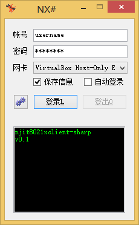

fork from
---
njit8021xclient: https://github.com/tengattack/8021xclient-for-windows

depends on
---
WinPcap: http://www.winpcap.org/
Please put the libary of WinPcap into WpdPack to compile and link the target.
.Net Framework 3.5: http://www.microsoft.com/

原始项目来自伟大的: https://github.com/liuqun/njit8021xclient
以及tengattack的windows分支。

本项目是对tengattack分支的修改，将其输出修改为DLL文件。然后添加了Nxsharp（njit8021xclient-sharp的缩写）程序作为GUI前端。Nxsharp程序依赖.Net Framework 3.5运行环境。项目在VS2013下编译生成，编译目标运行环境为x86。
界面截图
---

more info
---
